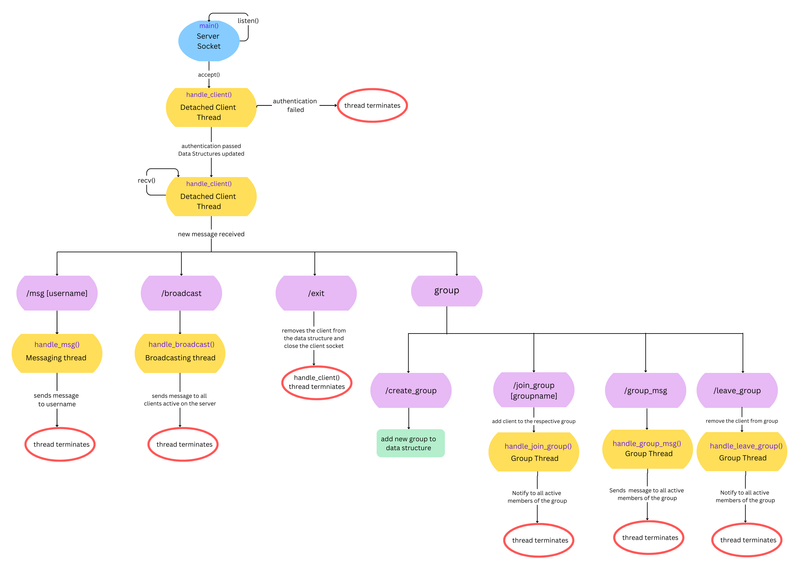

# Shadow Room : A TCP Multi-threaded Chat Server

This project is a multi-threaded TCP chat server written in C++. The server facilitates multiple clients to interact with one another via private messages, group messaging, and broadcasts. It includes authentication, message routing, and group management features.

## Working of the Code (server_grp.cpp)
<div style="width:1000px; height:650px; overflow:hidden;">
<figure>
  
  <figcaption>Code Flow Diagram : This image illustrates the flow of the code displaying major functions and events. This diagram is not exhaustive.</figcaption>
</figure>
</div>


#### The server code works as follows : 

1.  Server reads `users.txt` file and fills in the username to password map (`auth`) used for authentication.

2. **A server socket is created** and appropriate socket options are set.

3. The socket then **binds** to `PORT=12345`.

4. The server starts **listening** at this socket.

5. Now the server goes in an infinite while loop. In each iteration, a client socket is created at which server **accepts an incoming client** connection. **A thread is created and detached to handle this client**.

#### Each thread created above executes a **`client_handle`** function which works as follows : 

1. A prompt is send to the client asking for username.

2. After user enters the username, another prompt is sent asking for password.

3. If the username is valid (i.e., it is present in `users.txt`) and the password is correct, a welcome message is sent to the client. Also, all the other users in the chat are notified. All the data structures are updated accordingly. Otherwise, authentication fails so, that client socket is closed and function returns.

4. Control flow enters an infinite while loop where client actions are handled.

5. Firstly, the incoming message from the client is received. If receive fails or there is any error while recieving, the client exists (**`handle_exit`** function is invoked).

6. Otherwise, the incoming message is parsed to separate the `action` and the `message` part. A series of **if-else blocks** call the appropriate handler function based on the `action`. If the action is invalid, an error message is sent to the client.

---

## Design Decisions

### 1. Threading Model: One Thread per Client  
We chose to create a separate thread for each client and detach it. The main server thread listens for incoming connections, while each client is handled independently by its own thread.  

**Reasoning:**  
- This allows multiple clients to communicate concurrently without blocking the main server loop.  
- Each client’s operations (such as receiving and sending messages) can proceed independently.  
- The detached threads ensure that resources are freed once the client disconnects, preventing memory leaks.  

### 2. No Separate Processes  
Instead of creating a new process for each client, we opted for threads.  

**Reasoning:**  
- Processes do not share memory, making it difficult to maintain a shared data structure (such as a list of active clients).  
- Inter-process communication (IPC) would introduce additional complexity and overhead.  
- Threads are lightweight and share the same address space, making it easier to synchronise shared resources.  

### 3. Synchronisation with Locks  
Since multiple threads access shared resources, we used locks to prevent race conditions.  

**Where Synchronisation Was Needed:**  
- **Adding Clients:** When a new client connects, its information is added to a shared list of active clients. Without proper locking, simultaneous additions from multiple threads could corrupt the data structure.  
- **Broadcasting Messages:** When a message is sent, the server must iterate through the list of active clients and send the message to each one. Without locking, the list might be modified by another thread (e.g., a client disconnecting or connecting), leading to undefined behaviour.   

### 4. Use of Blocking Sockets over Non-Blocking Sockets  
We opted for blocking sockets rather than non-blocking sockets.  

**Reasoning:**  
- Blocking sockets simplify the design since each client’s communication is handled within its own dedicated thread.  
- Non-blocking sockets would require a more complex event-driven model (e.g., using `select` or `poll`), which wasn't necessary for our use case.  

### 5. Persistent TCP Connection
We chose a persistent connection over a non-persistent one. 

**Reasoning:**  
- Each client is handled by a dedicated thread, eliminating the need to establish a new connection for every message.
- Maintaining a persistent socket for each client simplifies direct messaging between clients.

## Features and Handler Functions
Every feature/action is handled by a corresponding handler function.  
### Primary Features 
1. **`handle_msg`**:
   - Handles the **`/msg`** action used for **private messaging**.
   - the `message` is parsed to extract the username. It is assumed that the username does not contain any whitespaces. 
   - Appropriate usage message is sent to the client in case of incorrect syntax.
   - Appropriate error message is sent in case of non-existent recipient.
   - If everything is correct, the `message` is sent to the user to whom it was intended.

2. **`handle_broadcast`**:
   - Handles the **`/broadcast`** action used for **broadcasting**.
   - The `message` is sent to all the users in the chat, except the sender. 

3. **`handle_create_group`**:
   - Handles the **`/create_group`** action used to create a new group.
   - The `message` is parsed to extract the group name. Note that the group name cannot have any whitespaces. So, anything after the first whitespace is discarded.
   - If the group name is empty, an appropriate usage message is sent.
   - If the group already exists, an appropriate error message is sent.
   - In all other cases a new group is created and `groupToMembers` map is updated. Note that, the creator of the group is by default a member of the group.

4. **`handle_join_group`**:
   - Handles the **`/join_group`** action used to join a group.
   - Message parsing and error handling is similar to `handle_create_group`, except that there is an extra check if the client is already a member of the requested group. In that case appropiate message is sent to notify this to the client.
   - Otherwise, `groupToMembers` map is updated, a joining message is sent to the client and all the other members of the group are notified. 

5. **`handle_leave_group`**:
   - Handles the **`/leave_group`** action used to leave a group.
   - Message parsing and error handling is similar to `handle_join_group`, except that now we check if the client is not a member of the requested group. In that case appropiate message is sent to notify this to the client.
   - Otherwise, `groupToMembers` map is updated, a leaving message is sent to the client and all the other members of the group are notified. 

6. **`handle_group_msg`**:
   - Handles the **`/group_msg`** action used to send a message to all members of the group.
   - Parsing and error handling is similar to `handle_msg`.
   - Message is sent to all the users of the group, (similar to `/broadcast`).
7. **`handle_exit`**:
   - Used primarily to handle the **`/exit`** action.
   - All the data structures are updated appropriately.
   - The client is assumed to leave all the groups it was a member of. Hence all the other members of the respective groups are notified of that this member has left the group.
   - All the members of the chat (except the client) are notified that this user has left the chat.
   - Client socket is closed and the function returns.

### Additional Features
1. **`handle_list_all_members`**:
   - Handles the **`/list_all_members`** action.
   - Sends a list of all the members in the chat to the client.

2. **`handle_list_all_groups`**:
   - Handles the **`/list_all_groups`** action.
   - Sends a list of all the existing groups to the client.
3. **`handle_list_group_members`**:
   - Handles the **`/list_group_members`** action.
   - Sends a list of all the members of the requested group to the client.
   - Parsing for the group name and error handling is similar to **`handle_create_group`**.
4. **`handle_help`**:
   - Handles the **`/help`** action.
   - Sends a list of all the available actions that the client can use along with there usage syntax as well as description of each action.
   - This function is automatically called once when the client enters the chat along with the welcome banner.
### Handling Abrupt Server Shutdown
If the server is shutdown using **`Ctrl+C`**, a **`sigint`** signal is generated. Server catches this signal using `signal(SIGINT, handle_sigint)`
The function **`handle_sigint`** closes all the client sockets and the server socket and allows the server to shutdown gracefully.

### Handling Abrupt Client Shutdown
If a client is shutdown using **`Ctrl+C`**, 0 bytes are received to the server, and then the server closes the client socket and performs all cleanups similar to the **`handle_exit`** function.

---

## Helper Functions

- **`isEmpty(string input)`**:
  Checks if a given string is empty.

- **`send_message(int client_sock, string message)`**:
  Sends the input message to a client using their file descriptor.

- **`broadcast_message(string message, int broadcast_fd)`**:
  Sends the input message to all the connected clients except the sender.

- **`private_mssg(string message, int recv_fd)`**:
  Sends the input message to the receiver. 

- **`group_mssg(string message, string group_name, int client_fd)`**:
  Sends the input message to all the members of the group, except the sender.

## Global Variables
- `auth` : Maps usernames to passwords for authentication check.
- `client_set`: Set of socket file descriptors of all the connected clients.
- `userToSocket`: Maps usernames to their respective socket file descriptors.
- `socketToUser`: Maps socket file descriptors to their respective usernames.
- `groupToMembers`: Maps group names to the set of members (their usernames) in that group.
- `mtx`: Mutex lock used while updating the data structures.
- `sock_fd`: Server socket file descriptor.

## Assumptions

- All clients connected to the server are the only active members in the chat.
- The client creating a group is the first member of that group.
- Each client logs in only through one terminal at any point of time.
- Client usernames and group names do not contain any whitespaces.
- Groups and clients are active only till the time they are connected to the server and the server is live.


## Restrictions in Our Server  

Our server is designed with parameterized limits, meaning key constraints can be adjusted as needed. The current limitations are as follows:  

### 1. Maximum Clients  
- The maximum number of clients that can connect is defined by the `MAX_CLIENTS` macro.  
- On a typical desktop computer with an **8-core CPU and hyper-threading (16 threads),** we can expect smooth performance with **approximately 16 clients**.  
- Beyond this, scheduling delays may introduce noticeable latency.  

### 2. Maximum Groups and Group Members
- Currently, there is **no explicit upper bound** on the number of groups and numbers of group members.  
- However, this is inherently restricted by the **available system memory (DRAM)**

### 3. Maximum Message Size  
- The size of a message is defined by the `MSG_SZ` macro and the username length is defined by `BUFF_SZ` macro, which can be adjusted as required.  

### 4. Performance Considerations  
- As more clients connect, performance degradation occurs due to **thread scheduling overhead**,impacting responsiveness..  
- In a high-load scenario, a more scalable approach (e.g., using **non-blocking I/O with `select()` or `epoll()`**) would be preferable.  

## Challenges Faced and Solutions  

While developing the TCP group chat server, we encountered several challenges. Below are some key issues we faced and how we resolved them:  

### 1. Handling Multiple Clients Concurrently  
- Initially, we struggled with managing multiple clients while simultaneously listening for new connections.  
- We explored various approaches and eventually learned how to use **threads** to handle multiple clients efficiently.  
- By creating a separate thread for each client and using proper synchronization techniques, we ensured smooth communication.  

### 2. "Bad File Descriptor" Error on Server Restart  
- When the server was forcefully shut down and restarted, we encountered a **"bad file descriptor"** error.  
- We investigated and discovered that the issue was due to the port being in a **WAIT_STATE** after abrupt termination.  
- To resolve this, we used the `SO_REUSEADDR` socket option, allowing the server to bind to the same port immediately after a restart.  

### 3. Graceful Shutdown Handling  
- Pressing `Ctrl+C` directly killed the process without properly closing all socket file descriptors, leading to resource leaks.  
- To address this, we implemented a **signal handler** using the `signal` library.  
- We registered a `handle_sigint` function, which ensures that all socket file descriptors are closed before the server exits gracefully.  

These challenges provided valuable learning experiences in **multi-threading, socket management, and system-level programming**.  


## How to Use Instructions
### Compilation:
Ensure that all the files including `Makefile` is in the same directory. Then run the following command -  
```bash
make
```
### Run the server:
Use the following command to start the server-
```bash
./server_grp
```
### Run a client:
Use the following comand to start a client-
```bash
./client_grp
```
Multiple clients can be run simultaneously using different terminals.


## Manual Testing
**Primary goal** of manual testing was to verify functionality and correctness of the server.
- **Unit Testing:** Each function was tested individually and in combination with other related functions to ensure all possible interactions are considered. 
   __For eg.__, group messaging related featured were tested together while broadcasting and mesasging features could be tested individually. 
- **Coverage:** We ensuerd __100% branch coverage__ by using appropritate test cases to test all possible path flows for each functionality.
- **Handling Shutdown:** Tests were conducted to simulate abrupt client or server shutdowns (using Ctrl+C). 

**Limitations:** Server could not be tested for correctness during concurrent access by clients. However we have ensured that locks are used appropriately whenever any shared data structured is accessed. 

## Automated Testing

**Primary goal** of automated testing was to test the server's ability to handle a large number of requests concurrently and efficiently, i.e., if a large number of clients can be served.

The automation allowed for __stress-testing__, especially for handling **heavy loads** and __scalability__ concerns.

### How we automated the process ?
- **`client_test.cpp`**: We modified `client_grp.cpp` to read input from a file instead of `std::cin`. The name of this file is taken as a command line argument. Also to avoid race throughs and simulate human like behavious, `sleep(1)` is added after each action. We compile this to form **`client_test`** binary.
- **`test_files.txt`**: All the files from which input is read are listed in this file.
- **`input files`**: The input files are named as **`com1.txt`**, **`com2.txt`**, and so on, although they could be named anything (change test_files.txt accordingly).
- **`run.sh`**: This is a bash script which works as follows. For each line **_i_** in `test_files.txt` - 
   - Open a new terminal.
   - Run `client_test` binary with the filename on the line **_i_** as command line argument. 
- The first two lines in the input files must contain correct username and password for logging in to the server.

One can use the following commands for testing - 
- Navigate to the test folder - 
```bash
cd test
```
- Install dependencies - 
```bash
sudo apt install gnome-terminal
```
- Compile `client_test.cpp` - 
```bash
g++ -std=c++20 -Wall -Wextra -pedantic -pthread client_test.cpp -o client_test
```
- Make sure that the server is running. Then run the script - 
```bash
./run.sh
```


## File Descriptions

- **`server.cpp`**: Main server implementation.
- **`client.cpp`**: Client implementation.
- **`users.txt`**: File containing user credentials for authentication.
- **`Makefile`**: Makefile for compilation.
- **`test/client_test.cpp`**: Modified client implementation for automated testing.
- **`test/run.sh`**: Bash script to run automated testing.

## Sources of Help and References  

While developing the TCP group chat server in **C++**, we referred to various sources for guidance and troubleshooting. Some key references include:  

### 1. **Official Documentation**  
- **C++ Socket Programming** - [C++ Reference](https://en.cppreference.com/w/cpp/net)  

### 2. **Multithreading and Synchronization**  
- **Using `std::thread` in Modern C++** - [C++ Reference](https://en.cppreference.com/w/cpp/thread/thread)  

### 3. **Locks and Synchronization**  
- **Mutexes and Locks in C++** - [C++ Standard Library - Mutex](https://en.cppreference.com/w/cpp/thread/mutex)  
- **std::lock and Deadlock Prevention** - [C++ Reference](https://en.cppreference.com/w/cpp/thread/lock)  
- **Concurrency and Parallelism in C++** - [cppreference: Threads](https://en.cppreference.com/w/cpp/thread)  

### 4. **Handling "Bad File Descriptor" and Port Reuse**  
- **Understanding `SO_REUSEADDR` in C++ Sockets** - [Beej's Guide to Network Programming](https://beej.us/guide/bgnet/html/)  
- **Socket States & `WAIT_STATE`** - [Stack Overflow](https://stackoverflow.com/questions/24194961/how-do-i-use-setsockoptso-reuseaddr)  

### 5. **Graceful Shutdown Handling**  
- **Using `signal` to Handle SIGINT (`Ctrl+C`)** - [Linux Man Pages](https://man7.org/linux/man-pages/man2/signal.2.html)  
- **Closing Sockets Properly in C++** - [GeeksforGeeks](https://www.geeksforgeeks.org/socket-programming-cc/)  

### 6. **General Networking and Debugging**  
- **Networking Concepts and Debugging Tips** - [Computer Networking: A Top-Down Approach](https://gaia.cs.umass.edu/kurose_ross/online_lectures.htm)  

## Team Contributors

- Dhruv Gupta (220361) [**`33.33%`**]
- Kundan Kumar (220568) [**`33.33%`**]
- Pragati Agrawal (220779) [**`33.33%`**]

All three of us contributed equally to the assignment. Every part was developed either by working together or having one person write while the other two review and debug it.
We collaboratively discussed the high level design of the server and thought about additional features to enhance its functionality in a meet. The README was also written with equal contribution from all of us.

## Declaration
We hereby declare that this assignment, tilted **Shadow Room : A TCP Multi-threaded Chat Server** is our original work. We have not engaged in any form of plagiarism, cheating, or unauthorized collaboration. All sources of information and references used have been properly cited.

## Feedback
This assignment gave us a better understanding of key concepts like socket programming, multithreading and concurrency. The provided sample output was particularly helpful in guiding our implementation. However, additional guidelines on error handling, such as dealing with invalid commands, multiple logins of same user, and unexpected disconnections, would have been beneficial.  Overall, we enjoyed working on this assignment as it provided hands-on experience on building a server with practical applications. 

We would like to express our gratitude to the Instructor and TAs for their continuous support throughout the assignment.
 
### _Thank You!_
